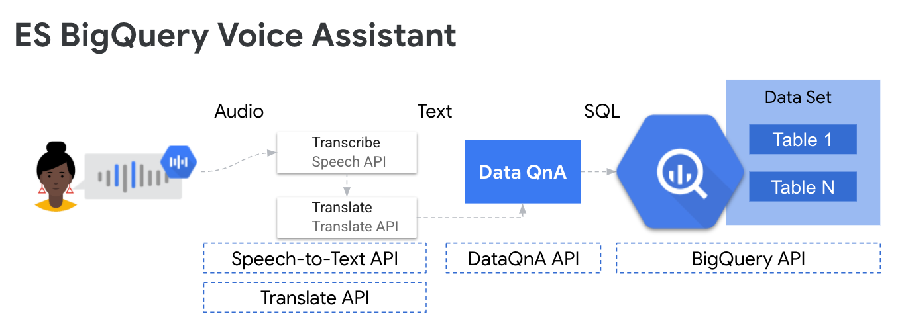

This repo contains a Jupyter notebook illustrating how to use the:
* BigQuery DataQnA API
* Translate API
* StT API demo

**Workflow:**
1. Get a Spanish command from the local microphone
2. Transcribe the audio file using Google Cloud StT APIs
3. Translate the transcript text to English
4. Use BQ DataQnA to run the command against the database - it will autogen SQL
